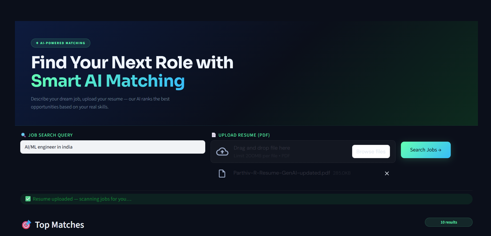
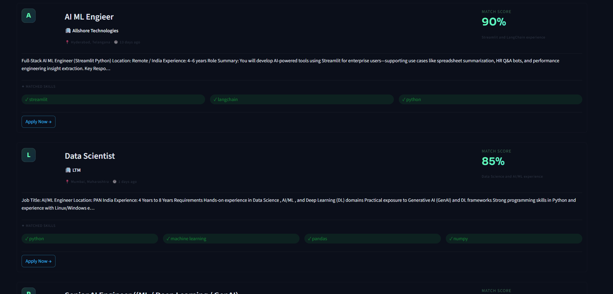

# 🤖 AI Job Search Agent

> Upload your resume. Describe your dream job. Let AI do the rest.

An intelligent job search agent that fetches real-time job listings, extracts your skills from your resume, and uses an LLM to rank every job by how well it matches your profile — with a percentage score and a reason.

---

## ✨ Features

- 🔍 **Natural language job search** — type queries like *"Gen AI Engineer in Bangalore"*
- 📄 **Resume skill extraction** — uploads your PDF and extracts your tech skills using LLM
- 🌐 **Dual API job fetching** — pulls live jobs from both **Adzuna** and **Jooble** in parallel
- 🧠 **LLM-powered ranking** — Llama 3.3 70B ranks each job with a **match percentage + reason**
- 💰 **Salary display** — shows salary range where available
- ✅ **Matched skills highlight** — shows exactly which of your skills matched each job
- 🎨 **Sleek dark UI** — built with Streamlit, styled like a modern job board

---

## 🖥️ UI





---

## 🏗️ Architecture

```
User Prompt + Resume PDF
        │
        ▼
┌─────────────────┐
│  fetch_jobs     │  ← Adzuna API + Jooble API (parallel)
└────────┬────────┘
         │
         ▼
┌─────────────────┐
│  load_resume    │  ← pdfplumber + LLM skill extraction
└────────┬────────┘
         │
         ▼
┌─────────────────┐
│  llm_rank_jobs  │  ← Llama 3.3 70B ranks all jobs by match %
└────────┬────────┘
         │
         ▼
    Ranked Results
    (score, reason, matched skills)
```

---

## 🛠️ Tech Stack

| Layer | Technology |
|---|---|
| Agent Framework | LangGraph |
| LLM | Llama 3.3 70B via Groq |
| LLM Orchestration | LangChain |
| Job APIs | Adzuna, Jooble |
| Resume Parsing | pdfplumber |
| UI | Streamlit |
| Language | Python 3.11 |

---

## 📁 Project Structure

```
ai_job_agent/
│
├── agent/
│   ├── graph.py          # LangGraph pipeline (3 nodes)
│   ├── nodes.py          # fetch_jobs, load_resume, llm_rank_jobs
│   ├── state.py          # AgentState TypedDict
│   └── llm.py            # Groq LLM setup
│
├── tools/
│   ├── adzuna_api.py     # Adzuna REST API integration
│   ├── jooble_api.py     # Jooble REST API integration
│   ├── resume_parser.py  # PDF text extraction
│   ├── resume_skills.py  # LLM-based skill extraction
│   └── utils.py          # time_ago helper
│
├── resume/               # Place your resume PDF here
├── app.py                # Streamlit UI
├── main.py               # CLI runner
├── .env                  # API keys (not committed)
└── requirements.txt
```

---

## ⚙️ Setup & Installation

### 1. Clone the repo
```bash
git clone https://github.com/Parthivr10/ai-job-search-agent.git
cd ai-job-agent
```

### 2. Create a virtual environment
```bash
python -m venv venv
venv\Scripts\activate        # Windows
source venv/bin/activate     # Mac/Linux
```

### 3. Install dependencies
```bash
pip install -r requirements.txt
```

### 4. Set up environment variables

Create a `.env` file in the root folder:
```env
GROQ_API_KEY=your_groq_api_key
ADZUNA_APP_ID=your_adzuna_app_id
ADZUNA_APP_KEY=your_adzuna_app_key
JOOBLE_API_KEY=your_jooble_api_key
```

> Get your free API keys:
> - Groq — https://console.groq.com
> - Adzuna — https://developer.adzuna.com
> - Jooble — https://jooble.org/api/about

---

## 🚀 Running the App

### Streamlit UI
```bash
streamlit run app.py
```

### CLI (terminal mode)
```bash
python main.py
# or pass query directly
python main.py Gen AI Engineer in Bangalore
```

---

## 🔑 Environment Variables

| Variable | Description |
|---|---|
| `GROQ_API_KEY` | Groq API key for Llama LLM |
| `ADZUNA_APP_ID` | Adzuna application ID |
| `ADZUNA_APP_KEY` | Adzuna application key |
| `JOOBLE_API_KEY` | Jooble API key |

---

## 📦 Requirements

```
streamlit
langgraph
langchain
langchain-groq
pdfplumber
requests
python-dotenv
```

---

## 🙌 Acknowledgements

- [Groq](https://groq.com) for blazing fast LLM inference
- [Adzuna](https://www.adzuna.com) for job listings API
- [Jooble](https://jooble.org) for job listings API
- [LangGraph](https://github.com/langchain-ai/langgraph) for the agent framework

---

<p align="center">thanks Parthiv</p>
